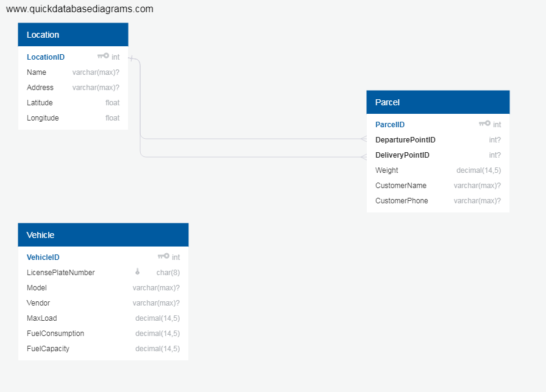

## Entities
### DB entities and relations
For the sake of simplicity and quicker MVP development, currently only the very basic entities should be implemented. Therefore features like multi-point routes, delivery time constraints and so on are omitted for now, but can be added later.



See the full database scheme https://app.quickdatabasediagrams.com/#/d/SXURVB

Routes will be calculated on the fly for the sake of interactivity and simplicity and will not be cached in the DB.

## Server setup guide
1. Install python 3.
2. Instal virtualenv (https://virtualenv.pypa.io/en/latest/installation/). For Mac/Unix:
```bash
pip install virtualenv
```
3. Create virtual environment called "venv" within the project directory. For Mac/Unix: 
```bash
virtualenv -p python3 venv
```
4. Activate virtual environemnt. For Mac/Unix:
```bash
source venv/bin/activate
```
5. Install server-side dependencies. Go to server/traffic_optimizer, run
```bash
pip install -r requirements.txt
```
6. Apply migrations:
```bash
python manage.py migrate
```
7. Run server:
```bash
python manage.py runserver 0.0.0.0:8000
```